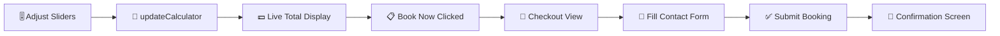

<div align="center">

<!-- Banner gradient via SVG badge trick -->


<br/>

[](https://developer.mozilla.org/en-US/docs/Web/HTML)
[](https://tailwindcss.com/)
[](https://developer.mozilla.org/en-US/docs/Web/JavaScript)
[](https://lucide.dev/)
[](LICENSE)

<br/>

> ✨ An elegant, fully-interactive pricing calculator page for photography editors and creative studios — with instant quotes, smooth animations, and a seamless booking checkout flow.

<br/>

</div>

---

## 📋 Table of Contents

- [✨ Features](#-features)
- [🎨 Preview](#-preview)
- [🛠️ Tech Stack](#️-tech-stack)
- [🗂️ Project Structure](#️-project-structure)
- [🚀 Getting Started](#-getting-started)
- [⚙️ Configuration & Customization](#️-configuration--customization)
- [💰 Pricing Breakdown](#-pricing-breakdown)
- [📖 How It Works](#-how-it-works)
- [📄 License](#-license)

---

## ✨ Features

<div align="center">

| 🎯 Feature | 📝 Description |
|---|---|
| 🎚️ **Session Duration Slider** | Drag to select 1–8 hours of shooting time |
| 💵 **Hourly Rate Selector** | Choose between Basic ($150/hr) and Premium ($250/hr) |
| 🖼️ **Image Count Control** | Increment / decrement the number of edited images |
| 📚 **Photo Album Picker** | None, Standard (20-page matte) or Premium (40-page leather) |
| 💡 **Live Price Calculation** | Total updates instantly as you adjust every slider & option |
| 📋 **Booking Checkout** | Multi-field contact form with order summary and confirmation |
| 🎨 **Theme Customization** | Business name, tagline, colors, and fonts via the Element SDK |
| 📱 **Fully Responsive** | Looks stunning on mobile, tablet, and desktop |
| 💫 **Smooth Animations** | Floating elements, gradient text, slide-up reveals, and glowing CTA |
| 🌑 **Dark Glassmorphism UI** | Deep-dark background with frosted-glass cards and vibrant accents |

</div>

---

## 🎨 Preview

<div align="center">

### Calculator View
```
┌─────────────────────────────────────────────────────┐
│  ● INSTANT QUOTE                                    │
│                                                     │
│         ✦  Clarity Studio  ✦                        │
│      Photography Pricing Calculator                 │
│                                                     │
│  ┌─────────────────────────────────────────────┐   │
│  │  🕐 Session Duration        2 hrs           │   │
│  │  ════════●══════════════════════════        │   │
│  │  1 hr                              8 hrs    │   │
│  │                                             │   │
│  │  💲 Session Type             $150/hr        │   │
│  │  ●══════════════════════════════════        │   │
│  │  Basic $150              Premium $250       │   │
│  │  ─────────────────────────────────────      │   │
│  │  🖼️  Edited Images      [−]  10  [+]        │   │
│  │  ─────────────────────────────────────      │   │
│  │  📚 Photo Album                             │   │
│  │  [ No Album $0 ] [ Standard $100 ]          │   │
│  │                  [ Premium  $300 ]          │   │
│  │  ─────────────────────────────────────      │   │
│  │   Estimated Total                           │   │
│  │   $800               [ Book Now → ]         │   │
│  │   Session: $300 · Editing: $500 · Album: $0 │   │
│  └─────────────────────────────────────────────┘   │
└─────────────────────────────────────────────────────┘
```

</div>

---

## 🛠️ Tech Stack

<div align="center">

| Technology | Version | Purpose |
|---|---|---|
| **HTML5** | — | Semantic page structure |
| **Tailwind CSS** | 3.4.17 | Utility-first styling & responsive layout |
| **Vanilla JavaScript** | ES2020+ | Interactive calculator logic |
| **Lucide Icons** | 0.263.0 | Crisp, consistent icon set |
| **Google Fonts** | — | *Syne* (display) + *Space Mono* (numbers) |
| **Element SDK** | — | Runtime theming & configuration |

</div>

---

## 🗂️ Project Structure

```
Pay-Page-for-Editor/
├── 📄 index.html      # Main application (calculator + checkout)
├── 📝 README.md       # You are here!
└── ⚖️  LICENSE        # MIT License
```

All logic, styles, and markup live in a **single `index.html`** — zero build steps, zero dependencies to install. Just open it in a browser and it works.

---

## 🚀 Getting Started

No build tools. No package manager. Just a browser.

```bash
# 1. Clone the repository
git clone https://github.com/rishwebb/Pay-Page-for-Editor.git

# 2. Navigate into the project
cd Pay-Page-for-Editor

# 3. Open in your browser
open index.html
# or
start index.html   # Windows
```

> **Tip:** For the full experience with Element SDK features, serve the file through a local HTTP server:
>
> ```bash
> npx serve .
> # Then visit http://localhost:3000
> ```

---

## ⚙️ Configuration & Customization

The page is powered by the **Element SDK** which allows runtime theming with zero code changes. Simply update the config object inside `index.html` to match your brand:

```js
const defaultConfig = {
  business_name:          'Clarity Studio',   // 🏢 Studio name in the hero
  tagline:                'Photography Pricing Calculator',
  cta_button_text:        'Book Now',          // 🔘 Call-to-action label
  background_color:       '#0D0D12',           // 🌑 Page background
  surface_color:          '#1A1A24',           // 🪟 Card / glass surface
  text_color:             '#FFFFFF',           // 🔤 Body text
  primary_action_color:   '#FF6B35',           // 🟠 Sliders, buttons, accents
  secondary_action_color: '#F7C59F',           // 🍑 Secondary highlights
  font_family:            'Syne',              // 🔡 Heading font
  font_size:              16                   // 🔠 Base font size (px)
};
```

All color values accept any valid CSS color string (`#hex`, `rgb()`, `hsl()`, etc.).

---

## 💰 Pricing Breakdown

The calculator supports the following customizable pricing variables:

| Component | Range / Options | Default |
|---|---|---|
| **Session Hours** | 1 – 8 hours | 2 hrs |
| **Hourly Rate** | Basic ($150/hr) · Premium ($250/hr) | $150/hr |
| **Edited Images** | 0 – ∞ (@ $50 each) | 10 images |
| **Photo Album** | None ($0) · Standard ($100) · Premium ($300) | None |

**Formula:**

```
Total = (Hours × Rate) + (Images × $50) + Album Price
```

---

## 📖 How It Works



1. **Visitor adjusts** the session duration, hourly rate, image count, and album type.
2. **JavaScript recalculates** the total in real-time with every interaction.
3. **"Book Now"** transitions to the checkout view, pre-filled with the quote summary.
4. **Contact form** collects name, email, phone, preferred date, and special requests.
5. **"Complete Booking"** submits the form and shows a confirmation message.

---

## 📄 License

This project is licensed under the **MIT License** — see the [LICENSE](LICENSE) file for details.

---

<div align="center">

Made with ❤️ and ☕ by [rishwebb](https://github.com/rishwebb)


</div>